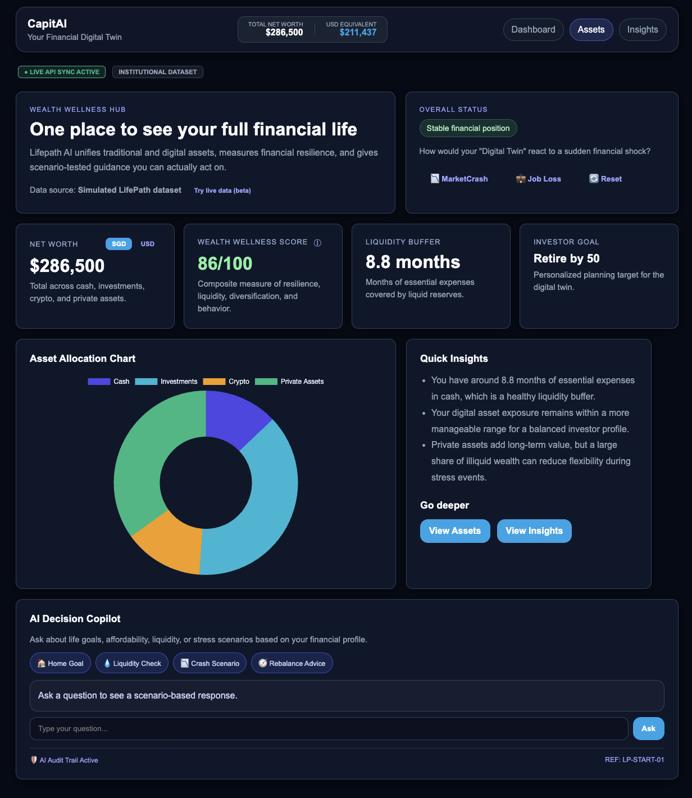
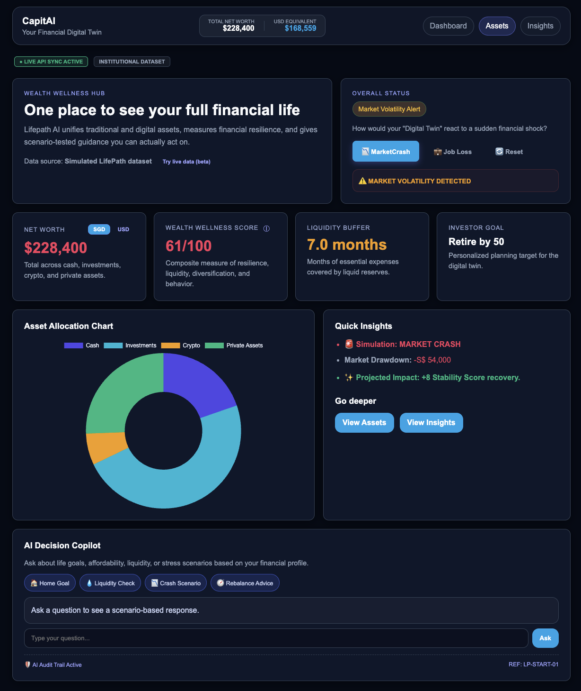
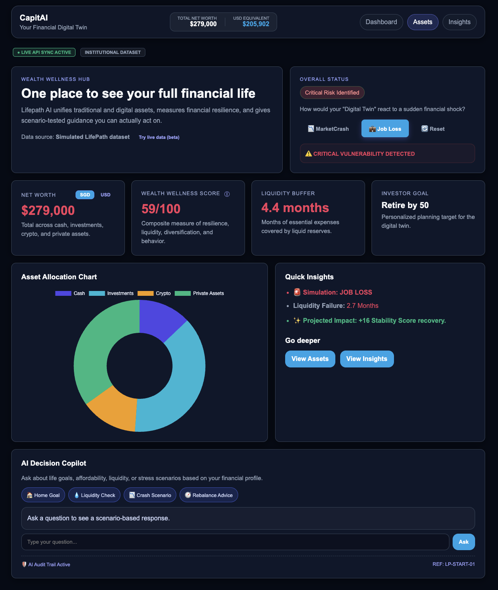

CapitAI is a prototype Wealth Wellness Hub designed to solve the growing problem of fragmented financial ecosystems. Modern investors manage assets across banks, brokerage platforms, private holdings, and digital wallets, making it difficult to understand their true financial resilience. CapitAI aggregates these disconnected sources into a unified financial model, providing a clear and actionable view of total wealth.

Unlike traditional dashboards that only display net worth, CapitAI acts as a proactive financial decision platform. It combines portfolio visualization with financial wellness analytics to evaluate key indicators such as diversification, liquidity resilience, concentration risk, and behavioral discipline.

The platform includes several integrated modules. A Unified Wealth Wallet consolidates traditional and digital assets into a structured portfolio view with a dynamic liquidity ladder. The Analytics Engine evaluates financial wellness using core portfolio health indicators. An Insights module generates personalized, color-coded recommendations to help users improve financial resilience.

CapitAI also features a Financial Shock Simulator that allows users to stress-test their portfolio against real-world scenarios such as market crashes, job loss, or crypto volatility. Scenario simulations dynamically update portfolio stability and liquidity runway.

Built using HTML, CSS, and Vanilla JavaScript, the prototype uses a lightweight global state system to connect modules into a seamless, interactive financial dashboard.

#DASHBOARD (MAIN) 

#MARKET CRASH DASHBOARD

#JOB LOSS DASHBOARD

